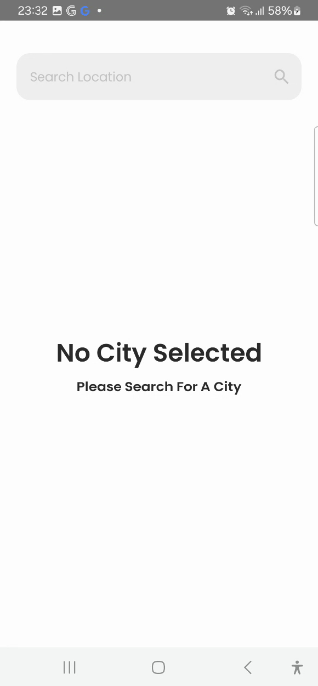
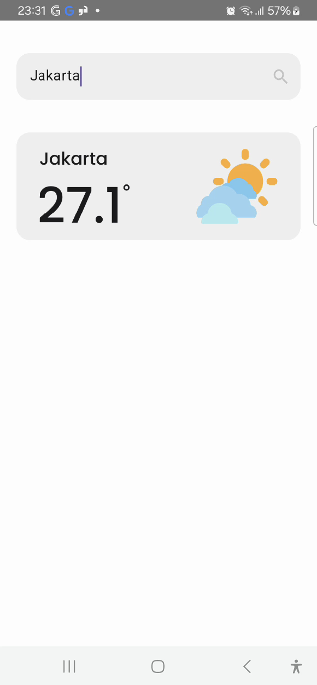
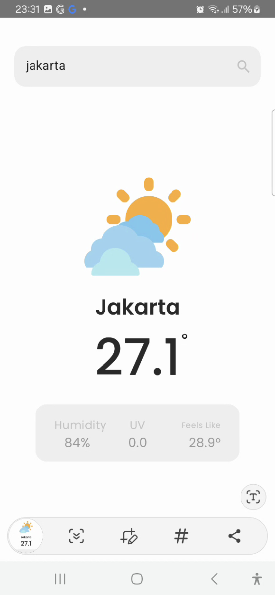

# 🌟 WeatheTracker: Nooro android take home test

WeatheTracker is a sleek and modern Android weather application that provides accurate weather information for any city worldwide. Built with the latest Android Jetpack components as per the requirement.

---

## 🚀 Features
- 🌤 **Current Weather**: Get real-time weather updates as per query search.
- 📍 **Search Locations**: Search weather by city name.
- 📊 **Detailed Forecasts**: View temperature, humidity, UV index, and more.
- 🖼️ **Dynamic UI**: Changes based on weather conditions.
- 🔄 **Offline Mode**: Displays cached data when offline using SharedPreference.

---

## 🛠️ Tech Stack
- **Programming Language**: Kotlin
- **Architecture**: MVVM (Model-View-ViewModel)
- **UI Framework**: Jetpack Compose
- **Dependency Injection**: Koin
- **Networking**: Retrofit with Coroutines
- **State Management**: Kotlin Flow
- **Image Loading**: Coil

## 🚀 Bonus
- **Security**: At this project i already implement certificate pinning to prevent man in the middle attack, also store important data such as apiKey, API endpoint in C++ file via JNI. So the data is more secure when the APK has been decompiled.

---

## 📱 Screenshots
| Home Screen                    | Search Feature                     | Weather Details                   |
|--------------------------------|------------------------------------|-----------------------------------|
|  |  |  |

---

## ⚙️ Installation
1. Clone the repository:
   ```bash
   git clone https://github.com/Asykur/WeatherTracker.git
